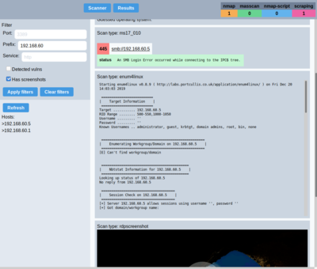

# ASSCAN - Automated Subnet Scanner




## Background

Recently, I did a network wide survey of our office infrastructure at work, on a /8 network with thousands of hosts. That was a basic recon / vuln finding exercise. I tried scripting everything, first doing initial scans with masscan to even find what we got, then nmapping for more details on everything, then lots of adhockery to find specific vulns and and finally screenshot most services that could be screenshot (rdp, vnc, web). Even with all the scripting, going through the results manually was time consuming at best. I wished I had a tool to do all this. Commercial tools exist but they cost a lot and can't be easily enhanced to run arbitrary custom scanners so I decided to roll my own.

The current state of the codebase is that enough features have been implemented for ASSCAN to be useful in some environments but otherwise it's really far from being finished and stable in any way. A lot is missing in terms of functionality and code quality, like input validation (there's none), runtime optimization, result filtering, etc. I decided to publish this smelling pile in hope of it being useful to neighboring hackers and to welcome contributions.

## Overview

ASSCAN is a glorified adhoc script running platform. It has a REST API to submit scan jobs and query results, either all of them or filtered by some criteria, including network prefix, discovered open ports, or discovered vulnerabilities. Also it has a web GUI.

The server part is written in Python3 on top of the tornadoweb framework. Scan jobs are run as shell scripts or commands. Interpreting scan results is either by reading xml files (masscan, nmap) or just parsing textual output of scan tools / scripts.

The web UI is a Vue single page application. I've never created a web frontend for anything so I was picking up javascript and shit up as I went. Some people I know suggested I use the Vue + vuex + tailwind tech stack for the GUI and I think it turned out well.

ASSCAN by itself has absolutely no security measures built in. Currently it doesn't validate user input in any way (feel free to contribute with PRs fixing this). As most scan jobs are shell commands constructed from unvalidated user input, anyone having access to the GUI can insta-pwn the whole box this runs on in no time. Also note that for nmap and masscan to run, the server process should most conveniently run as root. You can run the main process as a non root user and have it sudo the nmap and masscan processes for no security benefits of course.

## Installation

ASSCAN has been developed, tested and intended to be run on an up to date Kali box. It's a good idea to dedicate a computer or VM for running it to mitigate the effects of an unintended root access to the machine running ASSCAN.

### Dependencies

ASSCAN depends on a number of third party tools of which only some are included in this repo. Here's how to install dependencies (assume we are on an up to date Kali system).

```
sudo apt -y install python-pip python3-pip xvfb xdotool bc phantomjs imagemagick
sudo pip2 install vncdotool
sudo pip3 install webscreenshot
sudo apt -y install golang
sudo go get github.com/ffuf/ffuf
sudo cp /root/go/bin/ffuf /usr/local/bin # how do i install this in /usr/local
```

To develop the UI, install npm, maybe vue-cli, edit the files in ui/asscan, and run `npm install` and `npm run serve` to access the dev server or `npm run build` to produce a new build.

The following third-party dependencies or parts of them are included in this repo:
* [RDP-screenshotter](https://github.com/zer0-t/RDP-screenshotter), included in a modified form. RDP-screenshotter and its modifications here licensed under GNU GPL v3 as per the source. Licence information preserved in the script file.
* The `quickhits.txt` wordlist is from the [SecLists](https://github.com/danielmiessler/SecLists/) repository, licensed under the MIT license

These tools are used by ASSCAN and are awesome:
- [ffuf](https://github.com/ffuf/ffuf)
- [webscreenshot](https://github.com/maaaaz/webscreenshot)
- [vncdotool](https://github.com/sibson/vncdotool)

## Running ASSCAN

Run the `./server.py` script as root. Then, open `http://localhost:8888/` in a browser.

### Using the GUI

The GUI has two sections, "results" and "scanner". The results view is used to browse the scan results. The scanner view is used to submit new scan jobs.

In the scan view:
- The checkboxes select which scan to perform. *Always* start with masscan, as most of the other scan types implicitly only target hosts for which there are any previous results. The masscan job is fairly quick to execute.
- The target field should be a network address. If the target field has an IP host address, the netmask must be 32.
- For masscan jobs, the user can specify a "sub" netmask that splits the masscan job into smaller ones. For example, if the netmask is 16 and the sub netmask is 19, ASSCAN performs scan jobs with /19 netmask that cover the whole /16 network. Use if you want to see partial results sooner than waiting for a long time.
- For any scan, you can specify the port. Without port specified, scans use the default port(s). For example, ffuf runs against port 80, rdp on port 3389, vnc on 5900, etc. To screenshot VNC on port 5901, for example, specify the network/host, tick VNC, and type 5901 on the port field.

In the results view:
- the hosts list show either all discovered hosts, or hosts fulfilling the specified filters.
- "prefix" means the leading octets of a network address. `192.168` is a prefix that matches `192.168.x.x` addresses.
- port is port
- service matches what the nmap script scans report as discovered service. No other scan type than nmap fills this one.
- "Detected vulns" means that either the bluekeep or ms17-010 scanner has detected vulnerable hosts(s).
- "Has screenshots" means that any of the rdp, vnc, or web screenshot scans have saved a screenshot for the host

## Contributing

The codebase currently kind of works, contains shit code, but is able to perform basic recon. Contributions are welcome as long as they either improve the quality of the codebase or add cool new scan types. I'll be updating the issues tab on this repo for suggestions for improvement. Currently, the codebase could use some refactoring to generalize the scanners even more (so that new scanners could be implemented with minimal code reuse/copypasta), and input validation would be nice. Also, better looking UI...


## Contact

`<` `ossi` at `disobey` d0+ `fi` `>`